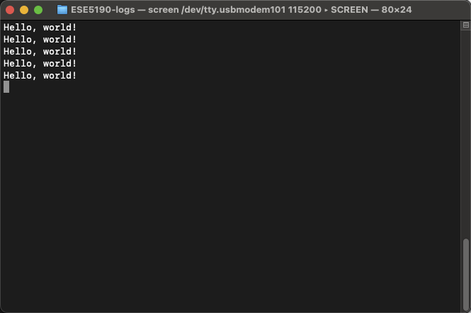

# Raspberry Pi RP2040 C SDK Setup Guide for Mac(with Apple Silicon)


This guide will set up the environment for C programming in Raspberry Pi RP2040 by installing the necessary SDK and tools. 

>**Machine**: Apple MacBook Air (M1, 2020)
>
>**System Version**: macOS Monterey version 12.5


## Chapter 0: Compatibility for Apple Silicon (M1/M2):

1. Copy the terminal and add x86 as the prefix. We don't want to mix up the x86 and ARM versions. 

   > Here we use the iTerm as the terminal.

2. Install x86 version homebrew:

   1. Install Intel-emulated Homebrew to the default `/usr/local`:

      ```shell
      arch --x86_64 /bin/bash -c "$(curl -fsSL https://raw.githubusercontent.com/Homebrew/install/master/install.sh)"
      ```

   2. Use `alias` for X86 Brew

      ```shell
      alias brewX86='arch --x86_64 /usr/local/Homebrew/bin/brew'
      ```

   3. Create another `alias` for the prefix path, so it will be easier if I want to get access to the Intel x86 lib.

      ```shell
      alias ib='PATH=/usr/local/bin'
      ```

   4. Whenever we ran into a duplicate lib version, we used `ib cmd` for the Intel version. 

      > E.g., For CMake, we can use `ib cmake` rather than `cmake` if we want to use Intel Version.

3. If you want to install Homebrew in the ARM Version.

   ```shell
   $ /bin/bash -c "$(curl -fsSL
   https://raw.githubusercontent.com/Homebrew/install/master/install.sh)"
   ```


## Chapter 1: Quick Pico Setup

### 0. Mac ToolChains and vscode

1. Already have `cmake` on my laptop.

    1. If you don't have CMake, you could use the command below to install it. 

        ```shell
        brew install cmake
        ```

        > **Note:** Based on my testing, It is okay to use the ARM version of CMake. Feel free to use it if you already have one.

2. Install other toolchains. 

   ```shell
   brew tap ArmMbed/homebrew-formulae
   brew install arm-none-eabi-gcc
   ```

3. Install vscode 

   > Here is the [link](https://code.visualstudio.com/download) to download Visual Studio Code.  

4. Install `git` if you don't have one. 

    ```shell
    brew install git
    ```

    

### 1.  Get the SDK and pico examples

1. Download the `pico` example and `SDK` in the `pico` folder. 

   ```shell
   $ git clone -b master https://github.com/raspberrypi/pico-sdk.git
   $ cd pico-sdk
   $ git submodule update --init
   $ cd ..
   $ git clone -b master https://github.com/raspberrypi/pico-examples.git
   ```

   

2. Setting `CMake` environment.

   1. First, we navigate to the `pico-example` folder, create a `.vscode` directory, and add a file called `setting.json` to tell CMake Tools to the location of the SDK. Additionally point Visual Studio at the CMake Tools extension.

      We add something below:

      ```json
      {
        "cmake.environment": {
        "PICO_SDK_PATH":"../../pico-sdk"
        },
      }
      ```

   2. Now click on the "Cog Wheel" at the bottom of the navigation bar on the left-hand side of the interface and select "Settings." Then in the Settings pane, click on "Extensions" and the "CMake Tools configuration". Then scroll down to "Cmake: Generator" and enter "Unix Makefiles" into the box.

   

   3. Go to the File menu, click "Add Folder to Workspace..." navigate to the pico-examples repo, and click "Okay." The project will load, and you’ll (probably) be prompted to choose a compiler. Select "GCC for arm-none-eabi" for your compiler.


## Chapter 2. Run HelloWorld Example 

### 1. Build all examples with SDK  

1. Build the C file and get the executable file. 

   1. Click on the "Build" button (with a cog wheel) in the blue bottom bar of the window. This will create the build directory and run CMake.

   2. Or you could run CMake to build, the same as clicking the "Build" button.

      ```shell
      cmake ..
      ```

      

2. Make the `hello_world` example.

   1. After we build the whole example, we get the `build` folder.

   2. Go into the `./pico-example/build/hello_world/usb` and make our example.

      ```shell
      make -j4
      ```

   3. Afterward, we get the `hello_world_usb.uf2` file in the current folder.   


### 2. Connect RP2040 and run the HelloWorld example

1. To connect our RP2040 in USB mode, we press the boot button when plugging into the USB port or hold the "boot" button after the device is connected and then press the "reset" button.

2. Drag the `hello_word_usb.uf2` into the USB device. Later, we see the USB drive disappears, which means all things are prepared. 

   > Note: We could find `.uf  ` file in`./pico-example/build/hello_world/usb` if following the instruction. 


3. Check the name of the USB port. 

   - Run the following command, and we will see some ports. 

     ```shell
     ls /dev/tty.*
     ```

   - You will see something below.

     ```shell
     /dev/tty.usbmodem101
     ```

     > Here, the name of this port is "usbmodem101."

7. Use `Screen` to monitor the output from RP2040. 

   - With the `screen` instruction, we need to use `screen /dev/tty.board_name 115200` to monitor the output from port "board_name."

   - Here, we have the board name "usbmodem101". Run the command below.

     ```shell
     screen /dev/tty.usbmodem101 115200
     ```

   - We will get the following output:

     
     
     


# Reference:

[Raspberry Pico C SDK Manual](https://datasheets.raspberrypi.com/pico/raspberry-pi-pico-c-sdk.pdf)

[Raspberry Pico C Getting Started Guide](https://datasheets.raspberrypi.com/pico/getting-started-with-pico.pdf)
